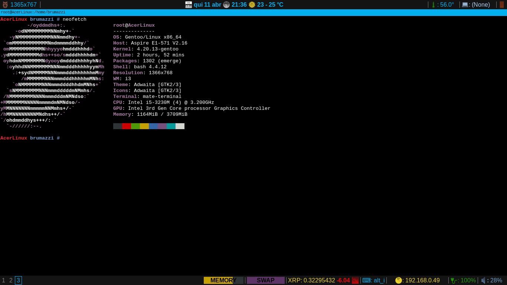

# i3blocks-Modules

I3 blocks with with sh modules

## Modules
* Backlight
* Volume support
* Battery info
* Network IP
* Keymap change (en | en-alt)
* Alt coins support
* Swap and Memory information
* Logout, suspend, shutdown and hibernate
* Monitor support
* Temperature
* Datetime and weather info
* Mouse location info
* Background slide

## Deps
* Unicode fonts
* xdotool
* CURL
* lm_sensors
* numlockx
* feh
* setxkbmap
* xbacklight
* mate-terminal
* dmenu
* j4-dmenu-desktop
* morc_menu
* python3
